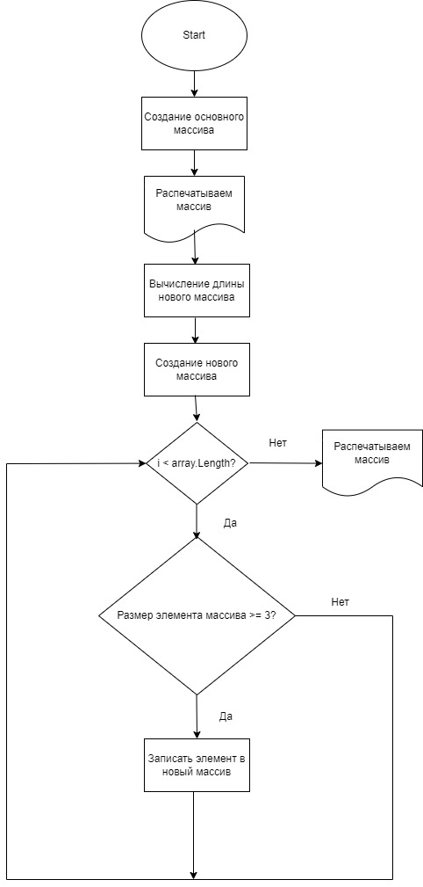

# Spec_Itog

# Описание работы программы
## 1. Создание основного массива
В ручную создается массив текстового типа (string).

## 2. Создание второго массива
С помощью метода `NewArray` узнём какой размер будет у нового массива. Затем с помощью цикла заполняем новый массив элементами, подходящими нам по условию (<= `size`).

## 3. Вывод на экран основного массива
С помощью метода `PrintArray` выводим основной массив на экран.

## 4. Вывод на экран полученного массива
С помощью метода `PrintArray` выводим новый массив на экран.
